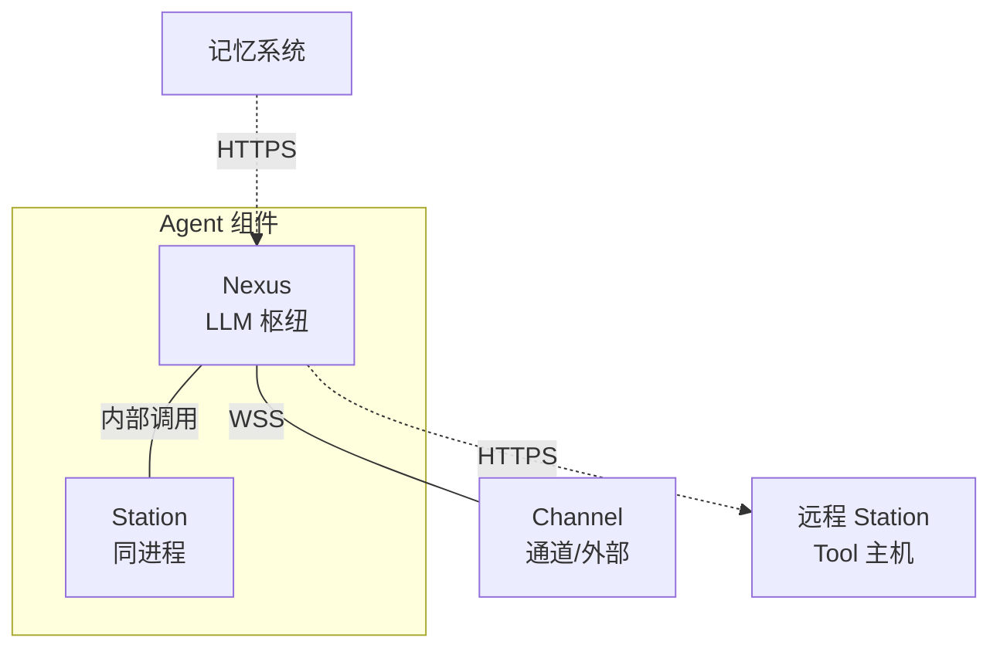

# kissbot-agent 组件设计

## 概述
Agent 是智能体组件，内部由两个模块组成——Nexus（LLM 通信枢纽）和 Station（Tool 执行主机）。Nexus 负责"思考"——与 LLM 通信处理输入输出，对接记忆系统；Station 负责"行动"——执行具体工具操作。nexus 通过内部调用与同进程 station 通信，通过 HTTPS 与远程 station 通信。

Agent 程序可在启动时选择开启的部分：
- **仅开启 nexus**：纯 LLM 交互，无工具执行
- **仅开启 station**：纯工具执行，无 LLM 交互
- **同时开启 nexus 和 station**：本地智能体

## 内部模块

### Nexus（LLM 通信枢纽）
- 每个 nexus 实例连接一个 LLM API
- 负责从记忆系统读取上下文，构建 LLM 输入
- 处理 LLM 输出，将 tool call 分派到 station
- 支持两种记忆模式（角色记忆/事件记忆）

详见 [kissbot-agent-nexus 内部设计](kissbot-agent-nexus.md)

### Station（Tool 执行主机）
- 接收来自 nexus 的 tool call 并执行
- 不直接与 LLM 通信
- 不直接对接记忆系统（tool 结果由 nexus 统一推送记忆）
- 可运行在通用服务器、网络设备、智能家电、机器人等多种形态上

详见 [kissbot-agent-station 内部设计](kissbot-agent-station.md)

### 记忆系统
- 由 nexus 对接记忆系统
- 两种组织模式：
  - **角色记忆**：按角色组织所有历史记录
  - **事件记忆**：按事件隔离上下文
- 路径后缀 `{role-name}` 或 `{role-name}-{event-id}` 由调用方拼接，完整路径由记忆基础模块构造

详见 [kissbot-memory 组件设计](kissbot-memory.md)

## 组合模式

Agent 启用不同的内部模块和记忆模式，形成多种工作方式：

| 启动模式 | 记忆模式 | 典型场景 |
|----------|----------|----------|
| 仅 nexus | 事件记忆 | 纯 LLM 问答，无需工具执行，每次对话为一个独立事件 |
| nexus + station | 事件记忆 | LLM 对话配合工程工具（文件操作、命令执行），每个工程任务为一个独立事件 |
| 多 nexus + 多 station | 角色记忆 + 事件记忆 | 有统一记忆的分布式 agent，持续收集信息、与人交互，并可独立完成专项 |

## 内部模块关系

Agent 组件内部包含两大模块：

**Nexus 模块**：负责 LLM 通信和记忆对接
- LLM 客户端：封装 LLM API 调用
- 上下文构建器：构建发送给 LLM 的完整上下文
- Tool 调用分派器：区分内置工具和外置工具，将外置工具分派到 Station
- 记忆读取器/写入器：对接记忆系统，处理角色记忆和事件记忆
- Station 路由器：维护 Station 连接和工具路由表
- 外部输入处理器：对接消息通道
- 内置工具集（含记忆查询 tool）

**Station 模块**：负责工具执行
- 工具注册表：管理可用工具列表
- 工具执行器：接收并执行 tool call
- HTTPS 服务器：处理 nexus 的 tool call 请求
- 工程工具集（Read、Write、Edit、Bash）
- 网络工具集（WebSearch、WebFetch）
Nexus 通过内部调用与同进程 station 通信，通过 HTTPS 与远程 station 通信。Agent 启动时根据配置选择启用 nexus 模块、station 模块或全部启用。
