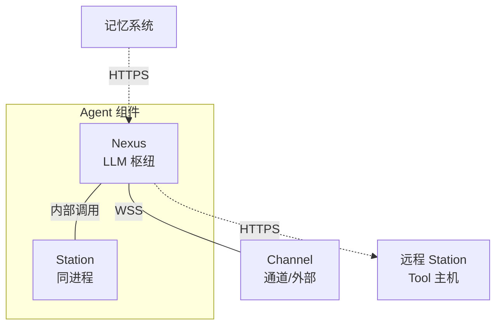

# system-design-agent 组件设计

## 概述
Agent 是智能体组件，内部由两个模块组成——Nexus（LLM 通信枢纽）和 Station（Tool 执行主机）。Nexus 负责"思考"——与 LLM 通信处理输入输出，对接记忆系统；Station 负责"行动"——执行具体工具操作。nexus 通过内部调用与同进程 station 通信，通过 HTTPS 与远程 station 通信。

Agent 程序可在启动时选择开启的部分：
- **仅开启 nexus**：纯 LLM 交互，无工具执行
- **仅开启 station**：纯工具执行，无 LLM 交互
- **同时开启 nexus 和 station**：本地智能体

## 核心功能

1. **LLM 驱动的智能对话**：从记忆系统读取上下文，调用 LLM 生成回复，将 tool call 分派到 station 执行
2. **工具执行**：通过 station 执行具体的工具操作（文件操作、命令执行、网络搜索等）
3. **分布式运行**：支持 nexus 和 station 各自独立部署运行，远程通过 HTTPS 通信

## 内部模块

### Nexus（LLM 通信枢纽）
- 每个 nexus 实例连接一个 LLM API
- 负责从记忆系统读取上下文，构建 LLM 输入
- 处理 LLM 输出，将 tool call 分派到 station
- 支持两种记忆模式（角色记忆/事件记忆）

详见 [kissbot-agent-nexus 内部设计](components-design/kissbot-agent-nexus.md)

### Station（Tool 执行主机）
- 每 agent 一个**全局单例**（`Station::get()` / `Station::new()`），启动时从 station.json 构建
- **嵌套结构**：本地 **Toolkit 集合**（工具实现表 + MCP 占位）+ 直接**子 Station 集合**（仅连接信息，HTTP 通信）；Toolkit 中无子 Station，孙子由子进程递归
- 工具元数据经 `tools(filter)` **递归平铺**（本地 toolkit 白名单过滤 + 直接子 HTTP 递归），工具名整树全局唯一
- 内置 filesystem toolkit（read 工具，配置显式声明 toolkit 名才注册）
- 接收来自 nexus 的 tool call 并执行
- 不直接与 LLM 通信
- 不直接对接记忆系统（tool 结果由 nexus 统一推送记忆）
- 可运行在通用服务器、网络设备、智能家电、机器人等多种形态上

详见 [kissbot-agent-station 内部设计](components-design/kissbot-agent-station.md) 与 [技术规格](../spec/kissbot-agent-station.md)

### 记忆系统
- 由 nexus 对接记忆系统
- 两种组织模式：角色记忆由角色标识，事件记忆由角色和事件共同标识
- nexus 按标识粒度和记忆系统通信

详见 [kissbot-memory 组件设计](components-design/kissbot-memory.md)

### 配置管理器
配置按三分结构管理：
- **AgentConfig（静态）**：从 KISSBOT_CONFIG 的 `agent` 段加载，启动后不变，含 `data_dir`、`mgmt_host`、`mgmt_port`、`ws_reconnect_interval_secs`（default_system_prompt / init_model 已移入 NexusRepo，init_model 与 default_model 语义重复已删）
- **NexusRepo / StationRepo（可改、落盘）**：持久化到 `<data_dir>/nexus.json` 与 `<data_dir>/station.json`，修改经 COW 写回；NexusRepo 存 channels / providers / memory_structs / context 与默认值（default_model、default_system_prompt），StationRepo 存 toolkits / sub_stations（station.json，见 [kissbot-agent-station 技术规格](../spec/kissbot-agent-station.md)）
- **运行状态（不落盘）**：作为 Nexus 字段，标量用 `ArcSwap`、集合用 `DashMap`，启动时从 NexusRepo 默认值初始化，运行期由管理命令修改，不回写

## 组合模式

Agent 启用不同的内部模块和记忆模式，形成多种工作方式：

| 启动模式 | 记忆模式 | 典型场景 |
|----------|----------|----------|
| 仅 nexus | 事件记忆 | 纯 LLM 问答，无需工具执行，每次对话为一个独立事件 |
| nexus + station | 事件记忆 | LLM 对话配合工程工具（文件操作、命令执行），每个工程任务为一个独立事件 |
| 多 nexus + 多 station | 角色记忆 + 事件记忆 | 有统一记忆的分布式 agent，持续收集信息、与人交互，并可独立完成专项 |

## 内部模块关系

Agent 组件内部包含两大模块：

**Nexus 模块**：负责 LLM 通信和记忆对接
- LLM 客户端：封装 LLM API 调用
- 上下文构建器：构建发送给 LLM 的完整上下文
- Tool 调用分派器：区分内置工具和外置工具，将外置工具分派到 Station
- 记忆读取器/写入器：对接记忆系统，处理角色记忆和事件记忆
- Station 委托：经全局 Station 单例执行 tools_for_session / execute_tool_call（toolkit 白名单平铺查询 + 工具调用）
- 外部输入处理器：对接消息通道
- 内置工具集（含记忆查询 tool）

**Station 模块**：负责工具执行
- 全局 Station 单例：本地 toolkit 集合 + 直接子 Station 集合（工具名整树全局唯一）
- Toolkit：工具实现表（跨 toolkit 全局唯一）+ MCP 占位
- 子 Station：仅连接信息 + StationClient HTTP 骨架（本轮未实现）
- 内置注册表：filesystem → read 工具
- 工具执行器：接收并执行 tool call（本地实现表 → 直接子 HTTP 递归）
Nexus 通过内部调用与全局 Station 单例通信（tools_for_session / execute_tool_call），子 Station 通过 HTTP 通信。Agent 启动时根据配置选择启用 nexus 模块、station 模块或全部启用。
