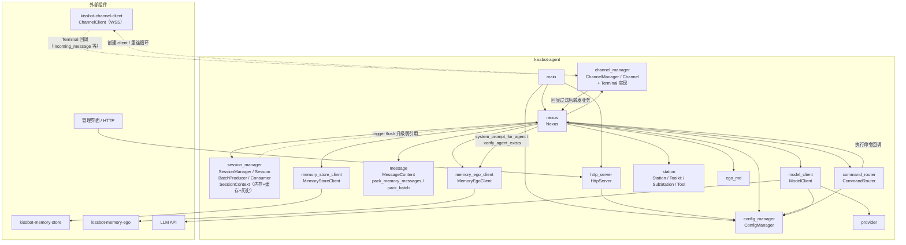
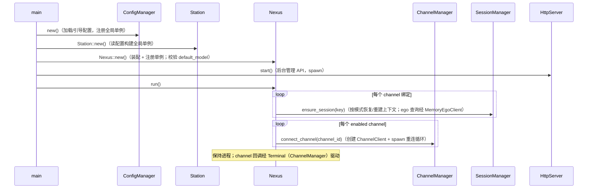
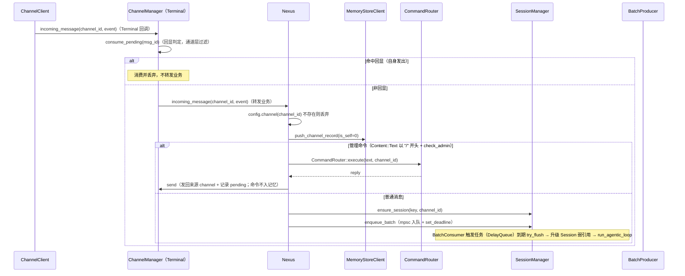
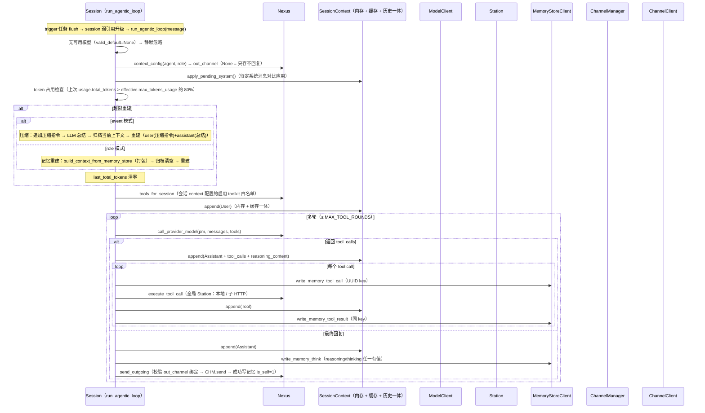
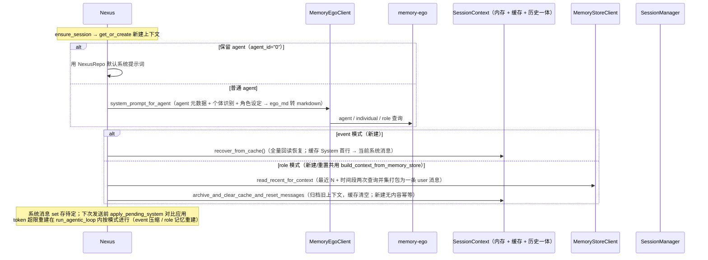

# kissbot-agent 组件调用关系

> 说明 kissbot-agent（后台 Rust 实现）内部各模块之间的调用关系，以及与外部的交互边界。
> 代码位置：`kissbot-agent/src/`。整体技术栈与部署形态见 [technical-architecture.md](technical-architecture.md)。

## 一、组件清单

| 模块 | 关键类型 | 职责 | 主要调用方 / 依赖 |
|------|----------|------|-------------------|
| main | — | 启动入口：加载配置、构建全局单例（ConfigManager → Station → Nexus）、spawn 管理 API、进入主循环 | 调 ConfigManager / Station / Nexus / HttpServer |
| config_manager | ConfigManager | 配置加载与读写（channel、provider/model、context、station、admin）；合成 effective 模型配置与默认值（default_model、default_system_prompt） | 被几乎所有模块调用 |
| nexus | Nexus | **编排中心**：消息业务处理（管理命令分发 / 普通消息路由）、会话管理、agentic loop 回调、工具分派（委托全局 Station）、通道连接调度、回复发送 | 持有全部运行时组件；被 channel_manager（Terminal 转发）、session_manager（弱引用升级）回调 |
| channel_manager | ChannelManager / Channel | **Terminal 实现**（通道适配层：回显过滤 + 转发业务）；每 channel 运行态（pending msg_id 回显判定、mode、client、断线通知）；连接 / 重连 / 发送封装 | 被 nexus 调用；被 channel-client 回调（Terminal） |
| session_manager | SessionManager / Session / SessionContext / BatchProducer / BatchConsumer | 会话全功能：三元组去重创建、合批（生产侧 mpsc 入队 + 触发任务 DelayQueue 定时 flush）、会话上下文一体（SessionContext 内存 + 缓存 + 历史归档，格式一致）；run_agentic_loop（LLM 调用、token 超限重建、多轮工具循环） | 被 nexus 调用；trigger 任务持 session 弱引用升级后调 run_agentic_loop（内部经 Nexus 单例回调） |
| command_router | CommandRouter | 管理命令解析与执行（/bind、/mode、/model 等） | 被 nexus 调用；执行时读 config |
| message | MessageContent / pack_memory_messages / pack_batch | 消息内容组装：extract_content（record/event → 文本段）、记忆交替序列打包、batch → 单条 User 打包 | 被 memory_store_client / session_manager / nexus 调用 |
| memory_store_client | MemoryStoreClient | memory-store 读写：推记录（channel / think / tool_call / tool_result）+ 读记忆（最近 N + 时间段两次查询并集打包） | 被 nexus 调用；读经共享 StoreHttpConfig |
| memory_ego_client | MemoryEgoClient | ego REST 客户端（agent / individual / role 查询）；system_prompt_for_agent / verify_agent_exists 经它发请求 | 被 nexus 调用 |
| model_client | ModelClient | LLM 调用（多轮重试、工具调用）与模型列表校验 | 被 nexus 调用；依赖 config（provider/model） |
| provider | Provider / OpenAiProvider / AnthropicProvider | 模型提供方（provider type → body 构造）解析 | 被 model_client 调用 |
| station | Station / Toolkit / SubStation / Tool / BuiltinToolkit | 全局 Station 单例：本地 toolkit 集合（工具实现表 + MCP 占位 + 内置注册表）+ 直接子 Station（仅连接信息，HTTP 递归）；tools(filter) 平铺查询 / call_tool | 被 nexus 调用 |
| station_client | StationClient | 子 Station HTTP 客户端骨架（list_tools / list_mcps / call_tool，未实现） | 被 station（子 Station 递归）调用 |
| ego_md | build_ego_identity_md / build_ego_individual_recognition_md / build_role_play_md | ego 结构 → 系统提示词 markdown | 被 nexus 调用 |
| http_server | HttpServer | 管理 API（config CRUD），认证走 kissbot-security | 被 main 调用；仅操作 ConfigManager |
| types | Mode / Message / SessionKey / ToolCall / ChannelCommand / ModelResponse … | 共享数据类型 | 被几乎所有模块引用 |

## 二、组件调用关系总览

## 三、启动流程

## 四、上行消息处理

## 五、Agentic Loop（LLM 回复 / 工具调用）

## 六、会话构建与上下文管理

## 七、对外交互边界

| 方向 | 组件 | 协议 | 说明 |
|------|------|------|------|
| agent → channel | kissbot-channel-client | WSS | agent 作为客户端连接消息通道；ChannelClient 持 `Weak<dyn Terminal>` 回调 ChannelManager（Terminal 实现：incoming_message / join_group / leave_group / user_removed / download_chunk / closed）；ChannelManager 回显过滤后转 Nexus |
| agent → memory-store | kissbot-memory-store | HTTP | MemoryStoreClient 推记录 + 读记忆 |
| agent → memory-ego | kissbot-memory-ego | HTTP | MemoryEgoClient 查询（agent / individual / role）；system_prompt_for_agent / verify_agent_exists 经它发请求 |
| agent → LLM | 模型提供方 API | HTTP | ModelClient 调用（支持重试、工具调用、reasoning 回传） |
| agent ← 管理界面 | HttpServer | HTTP | 当前仅 config CRUD（操作 ConfigManager）；管理命令走 channel 消息（/ 开头） |

## 八、未接线 / 预留

- **station_client（子 Station HTTP 协议）**：子 Station 只能 HTTP 通信，StationClient 为骨架实现（list_tools / list_mcps / call_tool）：list_tools / list_mcps 返回空集合（非报错无 warn 噪声）、call_tool 返回未实现；`Station::call_tool` 经 tool_routes 路由缓存路由到对应子（不遍历全部子），Err 分支保留给 HTTP 实现后的网络错误（记日志跳过，不阻塞整体）；HTTP 协议实现在 [kissbot-agent-station 技术规格](kissbot-agent-station.md) 中定义。
- **MCP 真实实现**：McpConfig 仅占位结构，`Station::mcps` 无生产消费方。
- **Terminal（ChannelManager）的 join_group / leave_group / user_removed / download_chunk**：回调为 no-op / 未使用，业务逻辑预留。
- **http_server ↔ nexus**：管理命令（/bind、/mode 等）目前由 channel 上行消息触发，HttpServer 未直接调用 nexus。
