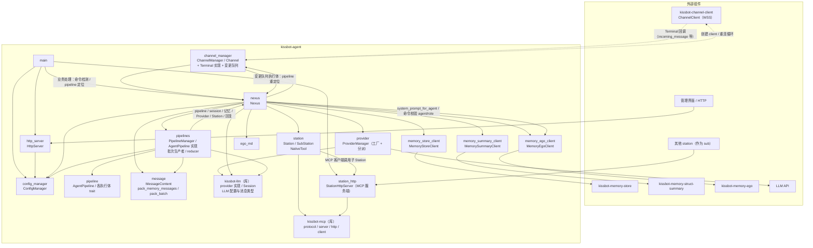
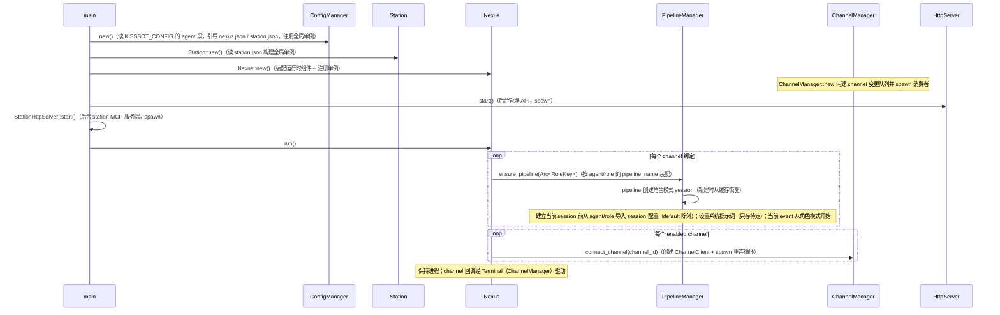
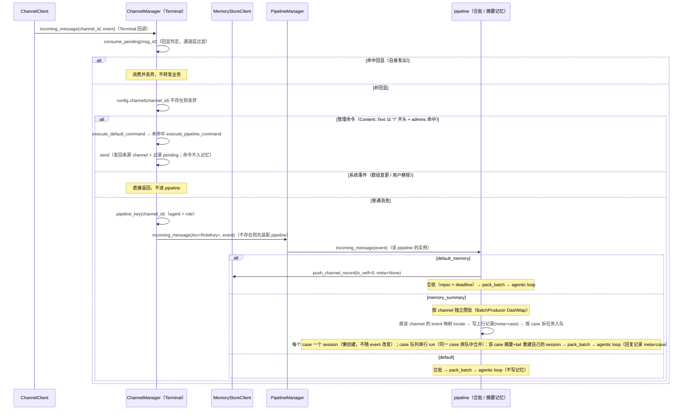
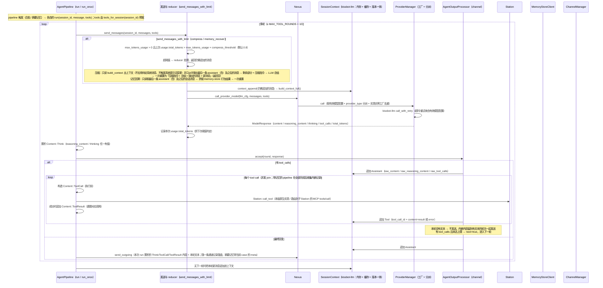

# kissbot-agent 组件调用关系

> 说明 kissbot-agent（后台 Rust 实现）内部各模块之间的调用关系，以及与外部的交互边界。
> 代码位置：`kissbot-agent/src/`。整体技术栈与部署形态见 [technical-architecture.md](technical-architecture.md)。

## 一、组件清单

| 模块 | 关键类型 | 职责 | 主要调用方 / 依赖 |
|------|----------|------|-------------------|
| main | — | 启动入口：加载配置、构建全局单例（ConfigManager → Station → Nexus）、spawn 管理 API 与 station MCP 服务端、进入主循环 | 调 ConfigManager / Station / Nexus / HttpServer / StationHttpServer |
| config_manager | ConfigManager | 配置加载与读写（channels / providers+models / memory_structs / (agent, role) 配置 / session 配置 / station / admin）；(agent, role) 可继承配置与 session 级值分开存储（含 memory_pipeline.load_memory）；`default_memory` / `memory_summary` 建立 session 前从 agent/role 导入配置，角色模式话题切换的新 session 用 `copy_session_config` 整体继承当前 session 配置（源 session 没有配置时按 agent/role 合成），`default` 只用 session 配置，运行期都只按 session_id 读写；pipeline 选择按 (agent, role) 合成 | 被几乎所有模块调用 |
| nexus | Nexus | **装配与启动中心**：pipeline 定位与装配（run 时）、通道连接调度、全局单例装配 | 持有全部运行时组件；被 channel_manager / pipelines 回调 Nexus 单例 |
| channel_manager | ChannelManager / Channel | **Terminal 实现**（通道适配层：回显过滤 + 业务消息处理：默认管理命令 / pipeline 命令 / 普通消息路由）；每 channel 运行态（pending msg_id 回显判定、client、断线通知）；连接 / 重连 / 发送封装；channel 变更串行队列（含执行体，pipeline 重定位内联在 apply_channel_key）。channel 只绑定 agent / role，当前 event 由 pipeline 维护 | 被 nexus 调用；被 channel-client 回调（Terminal）；变更执行体经 Nexus 单例读写 pipeline/config |
| pipeline | AgentPipeline / IncomingMessageProcessor / IncomingMessageBatchProcessor / TokenReducer | 定义 pipeline 的执行体抽象：消息接入（单条 / 整批）、token 压缩；`AgentPipeline` 提供 `reset_system_prompt`、`execute_command`（带来源 channel 三元组，pipeline 自行识别并执行 /mode、/model、outgoing 等管理命令）与 `channel_unbound`；工具调用直接用 pipelines 的 call_tool / call_tool_with_memory（并发 join） | 被 pipelines 实现/组合 |
| pipelines | PipelineManager / DefaultAgenticLoopPipeline / DefaultAgenticLoopPipelineWithMemory / MemorySummaryPipeline / BatchProducer / CompressTokenReducer / MemoryRecoverTokenReducer | pipeline 体系实现与注册表：按 `Arc<RoleKey>` 装配（pipeline 自行创建/持有 session）、工厂（`default` / `default_memory` / `memory_summary`）、保留/清理；pipeline 在内存中维护当前 event，`/mode` 由 pipeline 命令处理；session id 以 pipeline 前缀区分；`default` / `default_memory` 内存中只保留当前 event 的一个 session（切换 event 时释放旧 session 并从缓存重新读取），命令与批次进入同一条 mpsc 队列串行执行，`default_memory` 按事件/角色模式与 `memory_pipeline.load_memory` 决定超阈值时是否回溯，角色模式每批 run 前都用 LLM 判断是否同一件事、不同则换用自动生成的新 session_id（整体继承当前 session 配置）并只保留新消息，重建或 `/mode role` 时加载该 agent/role 修改时间最新的角色模式 session；摘要记忆 pipeline 为每个 channel 维护独立批次生产者与 channel → event 映射，触发时按该 channel 的 event locate 并按 case 拆成任务入队，case 串行执行、每个 case 使用独立 session 并用该 case 的摘要与结尾原文重建上下文，event 只影响 locate 与记忆范围，其 agentic loop 复用本模块的发送/工具/提示词函数 | 被 nexus 调用；实现体回调 Nexus 单例（Provider、记忆、Station、回复发送） |
| message | MessageContent / pack_memory_messages / pack_batch | 消息内容组装：extract_content（record/event → 文本段）、记忆交替序列打包、batch → 单条 User 打包 | 被 memory_store_client / nexus（记忆回溯打包）/ pipelines（合批 flush、摘要记忆上下文）调用 |
| memory_store_client | MemoryStoreClient | memory-store 读写：推通道记录（思考/工具内容内嵌在记录里，写入经 appender 批量投递并等待落盘）+ 读记忆（最近 N + 时间段两次查询并集打包） | 被 nexus 调用 |
| memory_ego_client | MemoryEgoClient | ego REST 客户端（agent / individual / role 查询）；system_prompt_for_agent / verify_agent_exists 经它发请求 | 被 nexus 调用 |
| memory_summary_client | MemorySummaryClient | 摘要记忆（memory-struct-summary）REST 客户端：case 定位、case 摘要、case 原文副本尾部查询 | Nexus 成员；MemorySummaryPipeline 经 Nexus 单例调用 |
| provider | ProviderManager | provider 工厂与分派（agent 运行时组件）：按 provider 名缓存实现实例（同名去重），解析有效模型配置并按 provider_type 分派调用 / 模型列表查询 | 被 nexus 调用（`call_provider_model` / `verify_model`）；实现与重试来自 kissbot-llm |
| kissbot-llm（库依赖） | Provider / Session / SessionContext / Message / ToolConfig / ProviderModelConfig… | provider 实现构造（`create_*_provider`）与带重试调用（`call_with_retry`）、模型列表；单会话上下文（内存 + 本地缓存 + 版本一体）；LLM 配置与消息类型 | 被 provider（构造实现 / 带重试调用）、nexus 与 pipelines（会话上下文）使用 |
| station | Station / NativeTool / Group / ToolImplement / SubStation / McpClient | 全局 Station 单例：本级工具索引（工具元数据 + 原生实现，由内置注册表按 group 名给出）+ 直接子 Station（仅连接信息，持 McpClient）；实现 McpHandler（server/discover / tools/list / tools/call），list_tools(ancestors) 平铺查询 / list_tools_local(groups) 按会话白名单本地过滤 / call_tool_local | 被 nexus（工具分组白名单）与 pipelines（工具调用适配层）调用；被 station_http 挂载为 MCP 处理器 |
| station_http | StationHttpServer / McpServer | station 对外 MCP 服务端（kissbot-mcp 的 McpServer + 单端点 `POST /mcp`，方法 server/discover / tools/list / tools/call），认证走 security.api_key | 被 main 调用；供其他 station 作为 sub 调用 |
| ego_md | build_ego_identity_md / build_ego_individual_recognition_md / build_role_play_md | ego 结构 → 系统提示词 markdown | 被 nexus（system_prompt_for_agent）调用 |
| http_server | HttpServer | 管理 API（config CRUD），认证走 kissbot-security | 被 main 调用；仅操作 ConfigManager |
| types | RoleKey / MemoryKey / ChannelCommand / RoleEvent 用法 | agent 侧共享数据类型（错误、pipeline 身份（RoleKey）、记忆范围（MemoryKey）、通道命令与 MCP→LLM 工具定义转换）；LLM 消息与配置类型见 kissbot-llm | 被几乎所有模块引用 |

## 二、组件调用关系总览

```mermaid
graph TB
    subgraph Ext["外部组件"]
        CC["kissbot-channel-client<br/>ChannelClient（WSS）"]
        MS["kissbot-memory-store"]
        MSA["kissbot-memory-struct-summary"]
        EG["kissbot-memory-ego"]
        LLM["LLM API"]
        UI["管理界面 / HTTP"]
        SUB["其他 station（作为 sub）"]
    end

    subgraph Agent["kissbot-agent"]
        MAIN["main"]
        CFG["config_manager<br/>ConfigManager"]
        CO["nexus<br/>Nexus"]
        CHM["channel_manager<br/>ChannelManager / Channel<br/>+ Terminal 实现 + 变更队列"]
        PL["pipeline<br/>AgentPipeline / 各执行体 trait"]
        PLS["pipelines<br/>PipelineManager / AgentPipeline 实现<br/>批次生产者 / reducer"]
        MSG["message<br/>MessageContent<br/>pack_memory_messages / pack_batch"]
        MSC["memory_store_client<br/>MemoryStoreClient"]
        MEC["memory_ego_client<br/>MemoryEgoClient"]
        ABC["memory_summary_client<br/>MemorySummaryClient"]
        PRV["provider<br/>ProviderManager（工厂 + 分派）"]
        KLLM["kissbot-llm（库）<br/>provider 实现 / Session<br/>LLM 配置与消息类型"]
        ST["station<br/>Station / SubStation<br/>NativeTool"]
        EGO["ego_md"]
        HS["http_server<br/>HttpServer"]
        SHS["station_http<br/>StationHttpServer（MCP 服务端）"]
        MCP["kissbot-mcp（库）<br/>protocol / server / http / client"]
    end

    MAIN --> CFG
    MAIN --> CO
    MAIN --> HS
    MAIN --> SHS
    HS --> CFG
    CO --> CFG
    CO --> CHM
    CO --> PLS
    CO --> MSG
    CO --> MSC
    CO --> MEC
    CO --> PRV
    PRV --> KLLM
    CO --> KLLM
    PLS --> KLLM
    CO --> ST
    CO --> EGO
    PLS --> PL
    PLS --> CFG
    PLS --> MSG
    PLS -->|pipeline / session / 记忆 / Provider / Station / 回复| CO
    CHM -. 创建 client / 重连循环 .-> CC
    CC -. Terminal 回调（incoming_message 等） .-> CHM
    CHM -->|业务处理：命令检测 / pipeline 定位| CO
    CHM -->|变更队列执行体：pipeline 重定位| CO
    MSC --> MS
    CO -->|system_prompt_for_agent / 命令校验 agent/role| MEC
    MEC --> EG
    CO --> ABC
    ABC --> MSA
    PRV --> LLM
    ST --> MCP
    SHS --> MCP
    ST -->|MCP 客户端调用子 Station| SHS
    SUB --> SHS
    UI --> HS
```

## 三、启动流程

```mermaid
sequenceDiagram
    participant main
    participant CFG as ConfigManager
    participant ST as Station
    participant CO as Nexus
    participant PLS as PipelineManager
    participant CHM as ChannelManager
    participant HS as HttpServer

    main->>CFG: new()（读 KISSBOT_CONFIG 的 agent 段，引导 nexus.json / station.json，注册全局单例）
    main->>ST: Station::new()（读 station.json 构建全局单例）
    main->>CO: Nexus::new()（装配运行时组件 + 注册单例）
    Note over CHM: ChannelManager::new 内建 channel 变更队列并 spawn 消费者
    main->>HS: start()（后台管理 API，spawn）
    main->>main: StationHttpServer::start()（后台 station MCP 服务端，spawn）
    main->>CO: run()
    loop 每个 channel 绑定
        CO->>PLS: ensure_pipeline(Arc<RoleKey>)（按 agent/role 的 pipeline_name 装配）
        PLS->>PLS: pipeline 创建角色模式 session（新建时从缓存恢复）
        Note over PLS: 建立当前 session 前从 agent/role 导入 session 配置（default 除外）；设置系统提示词（只存待定）；当前 event 从角色模式开始
    end
    loop 每个 enabled channel
        CO->>CHM: connect_channel(channel_id)（创建 ChannelClient + spawn 重连循环）
    end
    Note over CO: 保持进程；channel 回调经 Terminal（ChannelManager）驱动
```

## 四、上行消息处理

```mermaid
sequenceDiagram
    participant CC as ChannelClient
    participant CHM as ChannelManager（Terminal）
    participant MSC as MemoryStoreClient
    participant PLS as PipelineManager
    participant IP as pipeline（合批 / 摘要记忆）

    CC->>CHM: incoming_message(channel_id, event)（Terminal 回调）
    CHM->>CHM: consume_pending(msg_id)（回显判定，通道层过滤）
    alt 命中回显（自身发出）
        Note over CHM: 消费并丢弃，不转发业务
    else 非回显
        CHM->>CHM: config.channel(channel_id) 不存在则丢弃
        alt 管理命令（Content::Text 以 "/" 开头 + admins 命中）
            CHM->>CHM: execute_default_command → 未命中 execute_pipeline_command
            CHM->>CHM: send（发回来源 channel + 记录 pending；命令不入记忆）
        else 系统事件（群组变更 / 用户移除）
            Note over CHM: 直接返回，不进 pipeline
        else 普通消息
            CHM->>CHM: pipeline_key(channel_id)（agent + role）
            CHM->>PLS: incoming_message(Arc<RoleKey>, event)（不存在则先装配 pipeline）
            PLS->>IP: incoming_message(event)（该 pipeline 的实例）
            alt default_memory
                IP->>MSC: push_channel_record(is_self=0, meta=None)
                Note over IP: 合批（mpsc + deadline）→ pack_batch → agentic loop
            else memory_summary
                Note over IP: 按 channel 独立攒批（BatchProducer DashMap）
                IP->>IP: 按该 channel 的 event 映射 locate → 写上行记录(meta=case) → 按 case 拆任务入队
                Note over IP: 每个 case 一个 session（懒创建，不随 event 改变）；case 队列串行 run（同一 case 排队中合并）：该 case 摘要+tail 重建自己的 session → pack_batch → agentic loop（回复记录 meta=case）
            else default
                Note over IP: 合批 → pack_batch → agentic loop（不写记忆）
            end
        end
    end
```

## 五、Agentic Loop（LLM 回复 / 工具调用）

```mermaid
sequenceDiagram
    participant PL as AgentPipeline（run / run_once）
    participant MSN as 发送与 reducer（send_messages_with_limit）
    participant CO as Nexus
    participant CTX as SessionContext（kissbot-llm：内存 + 缓存 + 版本一体）
    participant PRV as ProviderManager（工厂 + 分派）
    participant OUT as AgentOutputProcessor（channel）
    participant ST as Station
    participant MSC as MemoryStoreClient
    participant CHM as ChannelManager

    Note over PL: pipeline 触发（合批 / 摘要记忆）→ 各自的 run(session_id, message, tools)；tools 由 tools_for_session(session_id) 预取
    loop 多轮（≤ MAX_TOOL_ROUNDS = 10）
        PL->>MSN: send_messages(session_id, messages, tools)
        alt send_messages_with_limit（compress / memory_recover）
            MSN->>MSN: max_tokens_usage > 0 且上次 usage.total_tokens > max_tokens_usage × compress_threshold（默认 0.8）
            MSN->>MSN: 超阈值 → reducer 处理，返回仍需追加的消息
            Note over MSN: 压缩：只读 build_context 出上下文（不应用待定系统消息、不触发系统提示词变更）并只从中弹出最后一条 assistant（含）及之后的消息 → 剩余部分 + 压缩指令 → LLM 总结<br/>→ 一次重置为「压缩指令 + 总结 + 弹出的消息 + 新消息」（返回空）<br/>记忆回溯：只读取最后一条 assistant（含）及之后的会话消息 → 拼接 memory-store 打包结果 → 一次重置
        end
        MSN->>CTX: context_append(仍需追加的消息) → build_context_full()
        MSN->>CO: call_provider_model(llm_cfg, messages, tools)
        CO->>PRV: call（取有效模型配置 + provider_type 分派 + 实现实例工厂去重）
        PRV->>PRV: kissbot-llm call_with_retry（超时/重试来自有效模型配置）
        PRV-->>MSN: ModelResponse（content / reasoning_content / thinking / tool_calls / total_tokens）
        MSN->>MSN: 记录本次 usage.total_tokens（供下次阈值判定）
        PL->>PL: 累积 Content::Think（reasoning_content / thinking 任一有值）
        PL->>OUT: accept(round, response)
        alt 有 tool_calls
            OUT->>CTX: 追加 Assistant（raw_content / raw_reasoning_content / raw_tool_calls）
            loop 每个 tool call（并发 join；带记忆的 pipeline 在全部完成后收集内嵌记录）
                PL->>PL: 构造 Content::ToolCall（执行前）
                PL->>ST: Station::call_tool（本级原生实现 / 路由到子 Station 的 MCP tools/call）
                PL->>PL: 成功时追加 Content::ToolResult（紧跟对应调用）
                OUT->>CTX: 追加 Tool（tool_call_id + content=result 或 error）
            end
            Note over OUT: 本轮没有文本 → 不发送，内嵌内容留到有文本的轮次一起发送<br/>有 tool_calls 且未达上限 → next=true，进入下一轮
        else 最终回复
            OUT->>CTX: 追加 Assistant
            PL->>CO: send_outgoing（本次 run 累积的 Think/ToolCall/ToolResult 内容 + 本轮文本；随一条通道记录落盘，摘要记忆带当前 case 的 meta）
        end
    end
    PL->>CTX: 无下一轮时把本轮新消息追加进上下文
```

## 六、pipeline 装配与上下文管理

```mermaid
sequenceDiagram
    participant CO as Nexus
    participant PLS as PipelineManager
    participant PL as AgentPipeline
    participant SC as SessionContext（kissbot-llm：内存 + 缓存 + 版本一体）
    participant SP as AgentPipeline::reset_system_prompt
    participant MEC as MemoryEgoClient

    CO->>PLS: ensure_pipeline(Arc<RoleKey>)
    alt pipeline 未装配
        PLS->>PLS: 按 agent/role 的 pipeline_name 创建 pipeline
        alt default / default_memory
            PL->>PL: 创建当前 event（新建时为角色模式）的 session（pipelines::pipeline_session_id(prefix, memory_key)，prefix 区分 pipeline）；default_memory 角色模式优先加载修改时间最新的角色模式 session（基础或 topic，不含 event），否则回退基础 id；recover_from_cache（每次切换 event 重新读取）
        else memory_summary
            Note over PL: 构造时不建 session；基准（-none）session 在入口/命令处理时创建，case session 在首次 run 时创建；每个新 session 创建时现场组装系统提示词
        end
        PL->>SC: 新建时 recover_from_cache()（正序全量回读；缓存 System 首行 → 当前系统消息）
        PLS->>SP: reset_system_prompt()（对已有 session 生效）
        Note over PL: 创建 session 前从 agent/role 导入 session 配置（default 除外）
        alt memory-ego 可用
            SP->>MEC: system_prompt_for_agent（agent 元数据 + 个体识别 + 角色设定 → ego_md 转 markdown）
            Note over SP: 保留 agent（agent_id="0"）/ 查询失败 → 回退默认提示词
        end
        SP->>SC: set_system_message（只存待定）
    else 已装配
        Note over CO: 直接复用（不重复恢复/装配）
    end
    Note over CO: 系统提示词在 build_context_full 时对比应用（需要变更才重写 sys 文件，不产生版本）；归档/重建只处理消息，版本同时保存 sys / msgs 两个文件，sys 使用原先文件<br/>记忆回溯在 send_messages_with_limit 内按阈值触发（memory_recover reducer 只读取最后一条 assistant 及之后的会话消息，拼接 build_context_from_memory_store 的打包结果后一次重置）；当前 event 为事件模式时恒用压缩，角色模式按 load_memory 选择压缩或回溯，且每批 run 前判断同话题：不同则换用新 session_id（继承当前 session 配置）并以新消息运行，旧 session 不归档不保存版本；default / default_memory 切换 event 时释放旧 session 并重新读取目标 event 的 session；命令与批次在同一队列串行
```

## 七、对外交互边界

| 方向 | 组件 | 协议 | 说明 |
|------|------|------|------|
| agent → channel | kissbot-channel-client | WSS | agent 作为客户端连接消息通道；ChannelClient 持 `Weak<dyn Terminal>` 回调 ChannelManager（Terminal 实现：incoming_message / join_group / leave_group / user_removed / download_chunk / closed）；ChannelManager 回显过滤后自行处理（默认命令 / pipeline 命令 / 普通消息，内部经 Nexus 单例取 pipeline、记忆与 Provider） |
| agent → memory-store | kissbot-memory-store | HTTP | MemoryStoreClient 推记录（`/store/*`）+ 读记忆（`/store/query/channel*`） |
| agent → memory-ego | kissbot-memory-ego | HTTP | MemoryEgoClient 查询（`/agent/get`、`/individual/get-all`、`/role/get`）；system_prompt_for_agent / verify_agent_exists 经它发请求 |
| agent → LLM | 模型提供方 API | HTTP | ProviderManager 按 provider_type 取 kissbot-llm 的实现（openai: `/chat/completions`、anthropic: `/v1/messages`），经 `call_with_retry` 支持重试、工具调用、thinking/reasoning 回传 |
| agent ← 管理界面 | HttpServer | HTTP | 当前仅 config CRUD（操作 ConfigManager）；管理命令走 channel 消息（/ 开头） |
| agent ← station（sub） | StationHttpServer | MCP（Streamable HTTP） | 单端点 `POST /mcp`，供其他 station 作为 sub 调用（server/discover、tools/list、tools/call），认证 security.api_key |

## 八、未接线 / 预留

- **无手动触发的 trigger**：当前没有独立 trigger 集合；pipeline 自己维护批次生产者，channel 解绑与 pipeline 销毁时退出消费者任务。
- **memory-struct**：`NexusRepo.memory_structs` 与 `MemoryStructConfig` 仅建结构，无消费方；摘要记忆的上下文由 `MemorySummaryPipeline` 经 memory-struct-summary 提供，其余会话的上下文回溯走 memory-store 的两查询并集。
- **Terminal（ChannelManager）的 join_group / leave_group / user_removed / download_chunk**：回调为 no-op / 未使用，业务逻辑预留。
- **`ModelResponse.finish_reason`**：已解析但无消费方（截断等停止原因不触发额外处理）。
- **http_server ↔ nexus**：管理命令（/bind、/agent、/role 等）目前由 channel 上行消息触发；/mode 由 pipeline 命令处理，HttpServer 未直接调用 nexus。
- **配置热更新监听**：ConfigManager 未提供变更监听，接入 Station/Nexus 为遗留事项。
