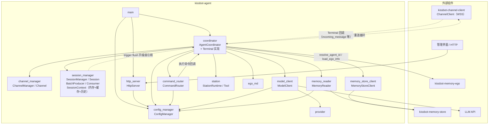
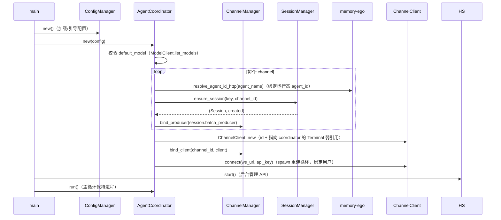
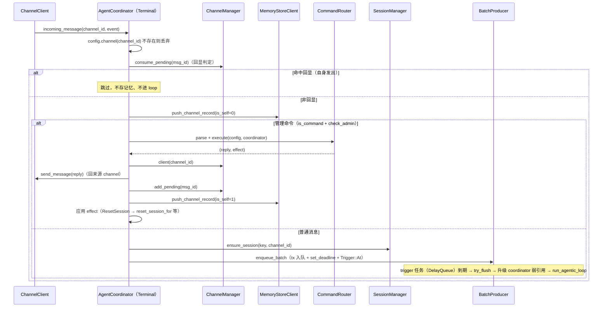
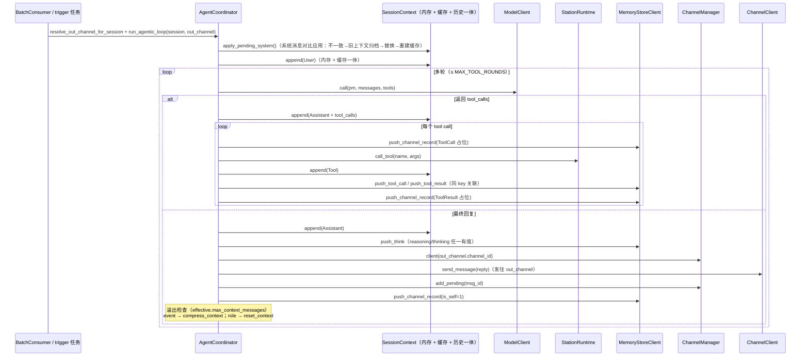
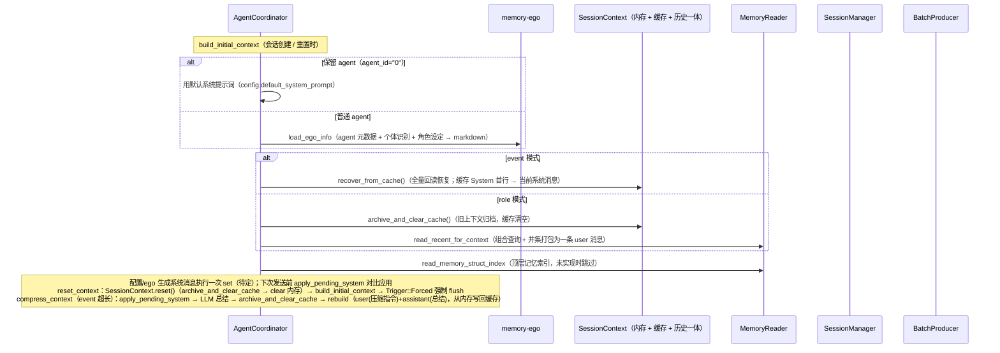

# kissbot-agent 组件调用关系

> 说明 kissbot-agent（后台 Rust 实现）内部各模块之间的调用关系，以及与外部的交互边界。
> 代码位置：`kissbot-agent/src/`。整体技术栈与部署形态见 [technical-architecture.md](technical-architecture.md)。

## 一、组件清单

| 模块 | 关键类型 | 职责 | 主要调用方 / 依赖 |
|------|----------|------|-------------------|
| main | — | 启动入口：加载配置、构建 Coordinator、启动管理 API、进入主循环 | 调 ConfigManager / AgentCoordinator / HttpServer |
| config_manager | ConfigManager | 配置加载与读写（channel、provider/model、context、station、admin）；合成 effective 模型配置 | 被几乎所有模块调用 |
| coordinator | AgentCoordinator | **编排中心**：实现 Terminal trait、消息处理、会话管理、agentic loop、工具分派、命令执行、通道连接 | 持有全部运行时组件；被 command_router / session_manager（弱引用）回调 |
| channel_manager | ChannelManager / Channel | 每 channel 运行态：pending msg_id（回显判定）、agent_id、mode、client、合批 producer | 仅被 coordinator 调用；无外部依赖 |
| session_manager | SessionManager / Session / SessionContext / BatchProducer / BatchConsumer | 会话全功能：三元组去重创建、合批生产侧（producer）与触发任务（consumer，DelayQueue 定时 flush）、会话上下文一体化（SessionContext 内存 + 缓存 agent-data/context + 历史归档 agent-data/context-history；三者格式一致，均为 <session_key编码>.jsonl 每行一条 Message，首行 System（如有）；归档 = 直接把当前内存写成一个历史文件，不复制缓存；系统消息变更走待定懒切换：set 只存待定，下次发送前对比应用，不一致则旧上下文（含原系统消息）先归档再替换重建；持久化对 coordinator 透明） | 被 coordinator 调用；trigger 任务经 session.coordinator 弱引用回调 coordinator |
| command_router | CommandRouter | 管理命令解析与执行（/bind、/mode、/model、/reset 等） | 被 coordinator 调用；执行时回调 coordinator + 读 config |
| memory_reader | MemoryReader | 从 memory-store 读记忆构建上下文（组合查询 + 并集打包、事件列表、记忆索引） | 被 coordinator 调用；依赖 config + memory-store |
| memory_store_client | MemoryStoreClient | 向 memory-store 推记录（channel / tool_call / tool_result / think） | 被 coordinator 调用 |
| model_client | ModelClient | LLM 调用（多轮重试、工具调用）与模型列表校验 | 被 coordinator 调用；依赖 config（provider/model） |
| provider | Provider | 模型提供方（provider type → body 构造）解析 | 被 model_client 调用 |
| station | StationRuntime / Tool | 本地 tool 执行主机（内置 Read 工具等）；configured_tools / call_tool | 被 coordinator 调用 |
| station_client / station_router | StationClient / StationRouter | 远程 station 连接骨架与路由表 | **尚未接线**（预留；coordinator 当前只用本地 station） |
| ego_md | build_ego_* | ego 结构 → 系统提示词 markdown | 被 coordinator 调用 |
| http_server | HttpServer | 管理 API（config CRUD），认证走 kissbot-security | 被 main 调用；仅操作 ConfigManager |
| types | Mode / Message / SessionKey / ToolCall … | 共享数据类型 | 被几乎所有模块引用 |

## 二、组件调用关系总览

## 三、启动流程

## 四、上行消息处理

## 五、Agentic Loop（LLM 回复 / 工具调用）

## 六、会话构建与上下文管理

## 七、对外交互边界

| 方向 | 组件 | 协议 | 说明 |
|------|------|------|------|
| agent → channel | kissbot-channel-client | WSS | agent 作为客户端连接消息通道；ChannelClient 持 `Weak<dyn Terminal>` 回调 coordinator（incoming_message / join_group / leave_group / user_removed / download_chunk / closed） |
| agent → memory-store | kissbot-memory-store | HTTP | MemoryStoreClient 推记录、MemoryReader 读记忆 |
| agent → memory-ego | kissbot-memory-ego | HTTP | resolve_agent_id（search-name）、load_ego_info（agent/individual/role 查询） |
| agent → LLM | 模型提供方 API | HTTP | ModelClient 调用（支持重试、工具调用、reasoning 回传） |
| agent ← 管理界面 | HttpServer | HTTP | 当前仅 config CRUD（操作 ConfigManager）；管理命令走 channel 消息（/ 开头） |

## 八、未接线 / 预留

- **station_client / station_router**：远程 station 连接与路由表，当前 coordinator 只用本地 `station_runtimes`（base_url 为空的本地 station 注册内置工具），远程调用走 REST 骨架、本轮未实现。
- **Terminal 的 join_group / leave_group / user_removed / download_chunk**：回调已实现（no-op / 未使用），业务逻辑预留。
- **http_server ↔ coordinator**：管理命令（/bind、/mode 等）目前由 channel 上行消息触发，HttpServer 未直接调用 coordinator。
